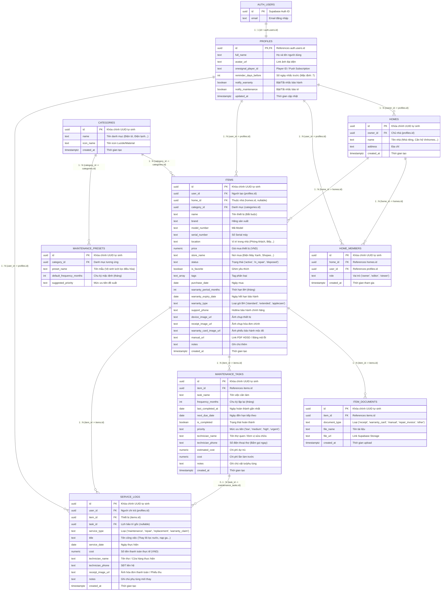

# Sơ Đồ Quan Hệ Cơ Sở Dữ Liệu Toàn Diện & Khả Năng Mở Rộng Cao (Scalable ERD) - HomeSync

Tài liệu này mô tả toàn diện hệ thống cơ sở dữ liệu quan hệ (PostgreSQL / Supabase) của dự án **HomeSync**, được thiết kế để **Scale** từ người dùng cá nhân đến mô hình hộ gia đình (Family Sharing), lưu trữ đa tài liệu (Document Vault), phân tích chi tiêu tài chính (Spending Analytics) và tự động hóa bảo trì.

---

## 📊 1. Sơ Đồ Thực Thể Quan Hệ (Mermaid ERD)

---

## 🗃️ 2. Mô Tả Chi Tiết Hệ Thống Bảng & Nghiệp Vụ

1. **`profiles`**: Quản lý thông tin mở rộng của người dùng và các thiết lập thông báo đẩy qua OneSignal.
2. **`homes` & `home_members`**: Cho phép chia sẻ thiết bị trong gia đình (Multi-tenancy Family Sharing). Vợ/chồng/con cái cùng xem và cập nhật lịch bảo dưỡng của các thiết bị trong nhà.
3. **`categories`**: Danh mục phân loại chuẩn (Điện tử, Điện lạnh, Gia dụng, Xe cộ, Thiết bị cá nhân, Khác).
4. **`maintenance_presets`**: Thư viện đề xuất bảo dưỡng tự động. Khi người dùng chọn thiết bị, hệ thống tự động gợi ý lịch bảo trì chuẩn của chuyên gia.
5. **`items`**: Bảng trung tâm lưu trữ toàn bộ dữ liệu thiết bị, số serial, thông tin bảo hành, hotline hỗ trợ hãng, ảnh chụp và vị trí phòng.
6. **`item_documents`**: Kho lưu trữ đa tệp đính kèm (hóa đơn VAT, phiếu bảo hành mộc đỏ, file PDF hướng dẫn sử dụng, ảnh tem máy).
7. **`maintenance_tasks`**: Lịch bảo trì định kỳ có nhắc việc, lưu số điện thoại thợ để bấm gọi ngay.
8. **`service_logs`**: Nhật ký chi phí tài chính cho phép thống kê tổng số tiền đã chi bảo trì/sửa chữa theo **Tuần**, **Tháng**, **Năm**.

---

## 🔒 3. Bảo Mật Dữ Liệu Tuyệt Đối (Row Level Security - RLS)

Mỗi bảng đều được áp dụng chính sách RLS ở tầng Database Engine của Supabase để đảm bảo người dùng chỉ xem và quản lý dữ liệu thuộc quyền sở hữu của mình hoặc các nhà (Homes) mà mình được chia sẻ.
