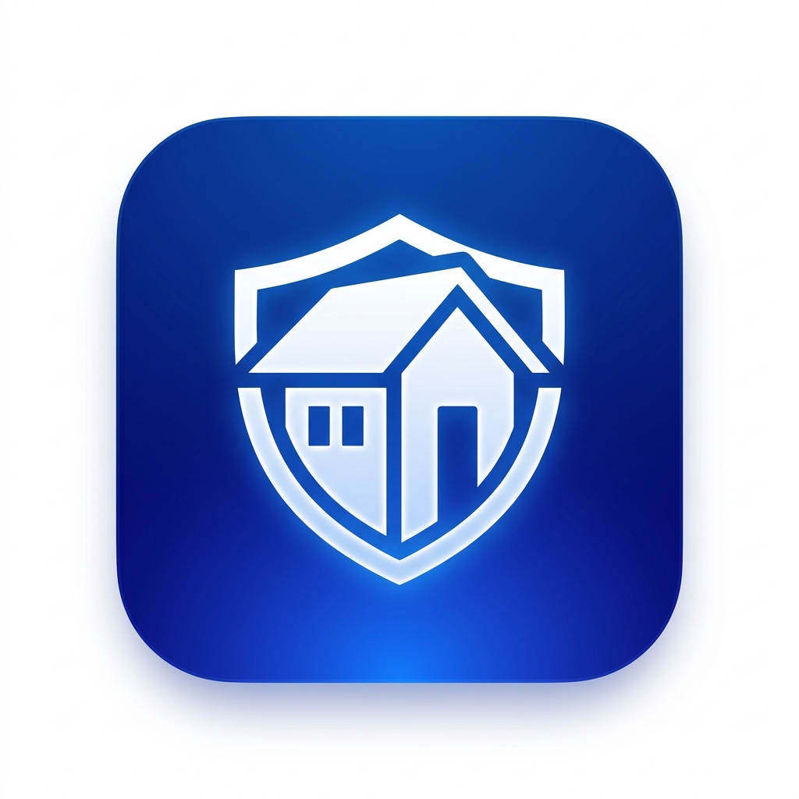

# 🏠 HomeSync - Quản Lý Tài Sản & Thiết Bị Gia Đình Thông Minh

<p align="center">
  
</p>

<p align="center">
  <b>Ứng dụng quản lý tài sản, theo dõi thời hạn bảo hành, lịch sử bảo dưỡng và đồng bộ đám mây cho gia đình hiện đại.</b>
</p>

<p align="center">
  
  
  
  
  
  
</p>

---

## 📖 Giới thiệu (Overview)

**HomeSync** là giải pháp toàn diện giúp các hộ gia đình số hóa toàn bộ tài sản, thiết bị gia dụng và hồ sơ bảo hành. Ứng dụng mang phong cách thiết kế **Minimalist Apple-like**, hoạt động mượt mà ở cả chế độ sáng (Light Mode) và tối (Dark Mode), hỗ trợ trải nghiệm tức thì (Guest Mode) và đồng bộ đám mây vĩnh viễn với Google.

---

## ✨ Tính năng nổi bật (Key Features)

- ⚡ **Guest Mode (Trải nghiệm tức thì 1 chạm):** Khám phá đầy đủ tính năng ngay khi tải app mà không bắt buộc đăng ký.
- 🔗 **Google Sign-In & Liên kết tài khoản:** Nâng cấp tài khoản Khách lên tài khoản Google chính thức để lưu trữ đám mây vĩnh viễn mà không làm mất dữ liệu dùng thử trước đó.
- 📦 **Quản lý thiết bị & Tài sản (Asset Management):**
  - Phân loại tài sản theo phòng (Phòng khách, Bếp, Phòng ngủ, Sân vườn,...).
  - Lưu trữ thông tin chi tiết: Tên thiết bị, số serial, thương hiệu, giá mua, ngày mua.
  - Chụp và đính kèm hình ảnh thiết bị, hóa đơn VAT và phiếu bảo hành.
- ⏰ **Cảnh báo hạn bảo hành & Trạng thái thông minh:**
  - 🟢 Còn hạn tốt (> 30 ngày)
  - 🟡 Sắp hết hạn (≤ 30 ngày)
  - 🔴 Đã hết hạn bảo hành
- 🛠️ **Nhật ký bảo dưỡng & Sửa chữa (Service Logs):** Theo dõi lịch sử bảo trì, thay thế linh kiện, đơn vị thực hiện và tổng chi phí phát sinh.
- 📄 **Xuất báo cáo PDF chuẩn bảo hiểm:** Tạo tài liệu PDF tổng hợp tài sản kèm ảnh chụp hóa đơn để phục vụ khai báo bảo hiểm hoặc quản lý tài chính cá nhân.
- 📲 **Thông báo đẩy thông minh (Push Notifications):** Tích hợp OneSignal nhắc lịch trước hạn 7, 14, 30 ngày.
- 📱 **Root UI Utilities:** Hệ thống `AppSnackBar` và `showAppDialog` bọc Root Navigator/Messenger thống nhất toàn ứng dụng.

---

## 🏛️ Kiến trúc phần mềm (Clean Architecture)

Dự án tuân thủ nghiêm ngặt **Clean Architecture** kết hợp mô hình **Feature-First**:

```
lib/
├── core/                         # Các thành phần dùng chung toàn app
│   ├── config/                   # Đọc cấu hình môi trường (--dart-define-from-file)
│   ├── constants/                # Bảng màu (AppColors), Typography, Styles
│   ├── di/                       # Dependency Injection (GetIt Service Locator)
│   ├── errors/                   # Định nghĩa Failure & Exception Type-Safe
│   ├── router/                   # GoRouter khai báo Declarative Navigation
│   ├── theme/                    # Theme cấu hình Light / Dark Mode
│   ├── utils/                    # AppSnackBar, DialogUtils, DateFormatters
│   └── widgets/                  # AppCard, CustomButtons, CommonUI
│
├── features/                     # Các module tính năng (Feature-First)
│   ├── auth/                     # Xác thực (Guest Mode, Google Sign-In, Link Account)
│   ├── dashboard/                # Màn hình Trang chủ, Thống kê, Báo cáo PDF
│   ├── items/                    # Quản lý Thiết bị & Tài sản
│   ├── maintenance/              # Lịch bảo trì & Nhắc hạn bảo dưỡng
│   ├── profile/                  # Trang cá nhân, Cài đặt thông báo, QR Share
│   └── service_logs/             # Nhật ký sửa chữa & Chi phí
│
└── main.dart                     # Điểm khởi chạy ứng dụng (App Entrypoint)
```

Mỗi Feature được chia thành **3 tầng độc lập**:
1. **Domain Layer:** Chứa `Entities`, `UseCases` và `Repository Interfaces` (Không phụ thuộc Framework).
2. **Data Layer:** Chứa `Models`, `DataSources` (Supabase, Google SDK) và `Repository Implementations`.
3. **Presentation Layer:** Chứa `BLoC/Cubit`, `Pages` và `Widgets`.

---

## 🛠️ Yêu cầu môi trường (Prerequisites)

- **Flutter SDK:** `>= 3.24.0`
- **Dart SDK:** `>= 3.5.0`
- **Android Studio / VS Code** đã cài đặt Flutter & Dart extensions
- **Java JDK:** 17+
- Tài khoản **[Supabase](https://supabase.com)** (Free tier)
- Dự án **[Google Cloud Console](https://console.cloud.google.com)** (cho Google Sign-In)

---

## 🚀 Hướng dẫn cài đặt & Chạy ứng dụng (Getting Started)

### 1. Clone mã nguồn
```bash
git clone https://github.com/your-username/homesync.git
cd homesync
```

### 2. Cài đặt thư viện dependencies
```bash
flutter pub get
```

### 3. Cấu hình file `config.json`
Tạo file `config.json` tại thư mục gốc của dự án (dựa trên mẫu `config.example.json`):

```json
{
  "SUPABASE_URL": "https://your-supabase-project.supabase.co",
  "SUPABASE_ANON_KEY": "your-supabase-anon-key",
  "ONESIGNAL_APP_ID": "your-onesignal-app-id",
  "GOOGLE_WEB_CLIENT_ID": "your-web-client-id.apps.googleusercontent.com"
}
```

> ⚠️ **Lưu ý bảo mật:** File `config.json` đã được thêm vào `.gitignore` để tránh để lộ API Key lên repository công khai.

---

## 🔐 Cấu hình Google Sign-In & Supabase Backend

### 1. Cấu hình trên Google Cloud Console:
Tạo **2 OAuth Client ID** trong cùng 1 project:
- **Client ID loại Android:**
  - Package Name: `com.example.home_sync`
  - SHA-1 Fingerprint: Lấy từ keystore debug máy bạn bằng lệnh:
    ```powershell
    cd android; .\gradlew signingReport
    ```
- **Client ID loại Web Application:**
  - Dùng ID này điền vào `GOOGLE_WEB_CLIENT_ID` trong `config.json`.
  - Copy Client ID và Client Secret để dán vào Supabase.

### 2. Cấu hình trên Supabase Dashboard:
1. Vào **Authentication** $\rightarrow$ **Providers** $\rightarrow$ Bật **Google** $\rightarrow$ Dán **Web Client ID** & **Client Secret**.
2. Bật **Anonymous Sign-In** (Authentication $\rightarrow$ Providers $\rightarrow$ Anonymous).
3. Chạy Trigger đồng bộ Profile khi User cập nhật (trong SQL Editor):

```sql
create or replace function public.handle_user_update()
returns trigger as $$
begin
  update public.profiles
  set
    full_name = coalesce(new.raw_user_meta_data->>'full_name', new.raw_user_meta_data->>'name', profiles.full_name),
    avatar_url = coalesce(new.raw_user_meta_data->>'avatar_url', new.raw_user_meta_data->>'picture', profiles.avatar_url),
    is_anonymous = coalesce(new.is_anonymous, false),
    updated_at = now()
  where id = new.id;
  return new;
end;
$$ language plpgsql security definer;

drop trigger if exists on_auth_user_updated on auth.users;
create trigger on_auth_user_updated
  after update on auth.users
  for each row execute function public.handle_user_update();
```

---

## 📱 Chạy ứng dụng (Run App)

Khởi chạy ứng dụng với cấu hình bảo mật `--dart-define-from-file`:

```powershell
flutter run --dart-define-from-file=config.json
```

Kiểm tra phân tích mã nguồn (Static Code Analysis):
```powershell
flutter analyze
```

---

## 🗺️ Lộ trình phát triển & Lưu ý vận hành (Roadmap & Production Notes)

Xem chi tiết tài liệu kỹ thuật về các lưu ý vận hành, cấu hình bảo mật nâng cao và kế hoạch phát triển các Phase tiếp theo tại:
👉 **[ROADMAP_AND_NOTES.md](file:///D:/Flutter/homesync/ROADMAP_AND_NOTES.md)**

---

## 📄 Bản quyền (License)

Dự án được phân phối dưới giấy phép **MIT License**.
Copyright © 2026 HomeSync Team.
